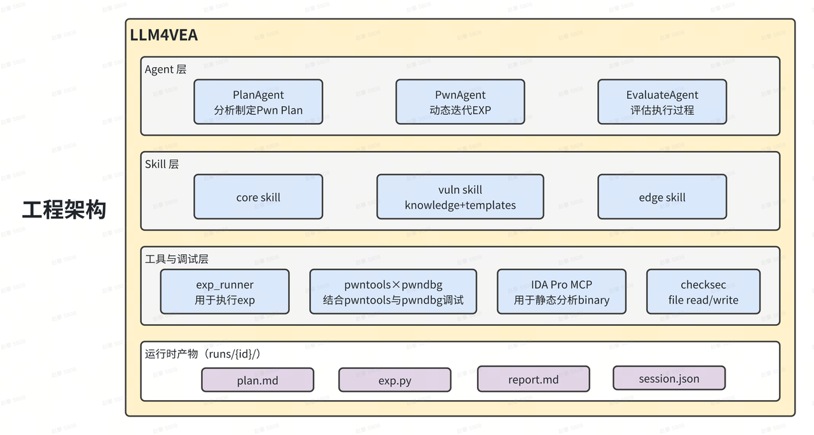
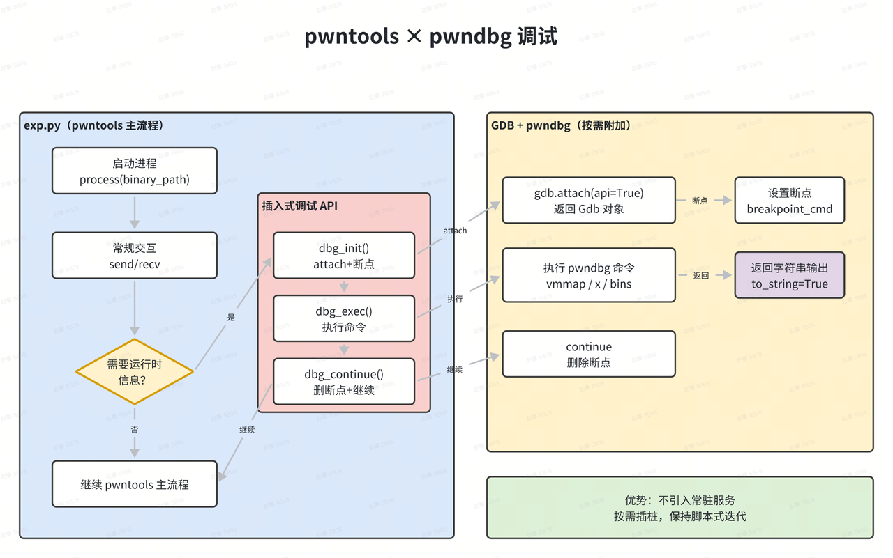

# LLM4VEA

> 内存漏洞可利用性判定 Demo

[观看演示视频](内存漏洞可利用性判定.mp4)

---

# 架构说明



## Agent 层（策略与决策）

概念上可以拆成 PlanAgent、PwnAgent、EvaluateAgent 三个角色：
- PlanAgent：只做静态分析与规划，输出 plan.md，把简单的 poc.md 扩展为更全面的 Pwn Plan
- PwnAgent：基于 plan.md 做动态调试与迭代，最终产出 exp.py 与 report.md
- EvaluateAgent：基于 solutions/*/exp.md 之类的"可打通参考解"评估生成质量

## Skill 层（领域知识与模板）

skills 位于 inputs/skills/，分为三类：
- core/：通用必读（如 checksec、pwntools、pwndbg）
- vuln/：按漏洞类型组织；每个 vuln skill 拆成 knowledge/（原理与判断）与 templates/（可改造的 EXP 骨架）
- edge/：常规路径失败、异常崩溃等边界问题

Plan 阶段会推荐后续需要读取的 skill 路径；Pwn 阶段按推荐路径渐进式阅读，并基于 templates 快速生成"可迭代"的 exp 骨架，避免生成内容过于发散。

## 调试层（pwntools × pwndbg 调试）

LLM4VEA 不依赖单独的常驻调试服务，而是在 exp.py 内选择性地 attach gdb，并执行 pwndbg 命令采集信息，采集后继续跑脚本。

这种方式的优势是：保持 pwntools 交互的便捷性，同时能在关键时刻获得运行时证据，例如 heap 布局、关键指针、地址计算与偏移验证。

## 静态分析：IDA Pro MCP 的最小暴露面

Pwn 阶段要求对关键函数必须读反编译与汇编，禁止猜测交互字符串或限制条件。默认通过 ida-pro-mcp-compact 只暴露两个 tool：
- list_user_funcs()：列出更像用户代码的函数名（排除库/导入/跳板等）
- view_func(query)：按函数名或地址返回反编译伪代码与带地址汇编，用于精确复制交互字符串、理解限制条件、定位关键偏移

## 本地 tools：让迭代可控

本地 tools 由 inputs/tools.json 定义 schema，并在运行时由 tool registry 执行。

其中 exp_runner 是闭环的核心：它负责执行 exp.py、设置超时防卡死，并清理残留的 gdb 进程，保证多轮迭代的稳定性。

# pwntools × pwndbg 调试



```python
def dbg_init(breakpoint_cmd):
    """
    初始化 GDB 并启用 Python API（单例模式）
    
    首次调用：附加 GDB 到进程并设置断点
    后续调用：在已附加的 GDB 中设置新断点
    
    返回 Gdb 对象，可用于程序化控制
    注意: gdb.attach() 当 api=True 时返回 (PID, Gdb) 元组
    """
    global gdb_instance
    if gdb_instance is None:
        pid, gdb_obj = gdb.attach(p, gdbscript=breakpoint_cmd, api=True)
        gdb_instance = gdb_obj
    else:
        gdb_instance.execute(breakpoint_cmd)
    return gdb_instance

def dbg_exec(cmd):
    """
    在 GDB 中执行命令并返回输出
    所有 GDB/pwndbg 命令都可以通过此函数执行
    """
    if gdb_instance is None:
        raise Exception("GDB not initialized. Call dbg_init() first.")
    return gdb_instance.execute(cmd, to_string=True)

def dbg_continue():
    """
    删除断点并继续执行程序
    
    此函数会：
    1. 删除当前所有断点（避免后续执行时再次停止）
    2. 继续执行程序
    
    如果需要在其他程序状态打断点，应再次调用 dbg_init()
    """
    if gdb_instance is None:
        raise Exception("GDB not initialized. Call dbg_init() first.")
    gdb_instance.execute('delete breakpoints')    
    try:
        gdb_instance.execute('c')
    except:
        pass
```

## 核心思路

把调试从"常驻服务/人工交互"变成"脚本内按需插桩"，让 LLM 能在每一轮迭代中获取运行时证据并自动收敛。

## 三个 API 各自解决什么问题

### dbg_init(breakpoint_cmd)

负责一次性把 GDB 附加到 pwntools 启动的进程，并设置断点，同时启用 Python API：
- 首次调用：gdb.attach(..., api=True) 拿到可编程控制的 Gdb 对象
- 后续调用：复用同一个 Gdb 实例，只更新断点脚本

这使得调试能力可以作为"工具句柄"在 exp.py 里持续使用，而不需要在外部维护额外服务。

### dbg_exec(cmd)

负责在 GDB 中执行命令并返回输出字符串：
- 可以执行 gdb/pwndbg 的任意命令
- 必须把输出打印到 stdout，作为 LLM 在下一轮推理时的证据输入（例如 vmmap、x/gx、bins 等）

### dbg_continue()

负责"清场并继续"：
- 删除所有断点，避免后续重复停住
- 继续执行进程，让 exp.py 回到 pwntools 的常规交互流

因此从整体效果看，调试像是"短暂插入的一段采样动作"，采样完成后流程恢复正常。

## 为什么比 pwndbg-server 更适合自动化迭代

### 插入式调试（本方案）

- 调试能力跟随 exp.py 走，按需调用
- 输出天然落在 stdout，可被 exp_runner 捕获
- 不需要维护额外服务的生命周期与协议

### 常驻 server（对比）

- 需要额外的进程/端口/状态管理
- Agent 侧要处理更多的交互复杂度
- 与 pwntools 主流程割裂，证据链更难回放
